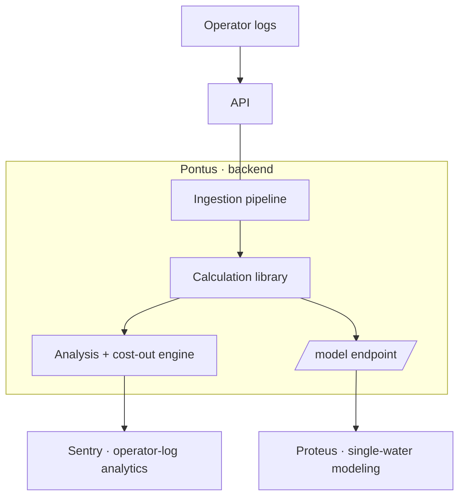

# Nereus

**Vendor-neutral, log-native analytics for industrial water treatment.**

Nereus turns the operator logs that cooling-tower and process-water facilities already keep into validated analytics, clear graphs, and a ranked list of where they're losing money — in real dollars, from their own data. No new sensors, no chemical-supplier lock-in.

> **Building on Nereus?** Start with the **[Nereus PRD & Roadmap](../NEREUS_PRD.md)** — what we're building, the milestones, and the current focus. This README is the durable map of the org; the PRD is the living plan.

---

## What Nereus does

Industrial cooling systems (towers, chillers, closed loops) and process-water operations generate a steady stream of hand-entered logs — chemistry, temperatures, flows, chemical use. That data is usually trapped in spreadsheets and rarely turned into decisions.

Nereus reads those logs and:

- **Makes sense of messy data** — detects missing tests, entry errors, irregular sampling, and gaps, and reports them clearly.
- **Shows the operation** — a library of time-series, statistical-process-control, water-balance, cooling-performance, and cost graphs.
- **Finds the money** — ranks cost-out opportunities (water, sewer, chemical, and energy savings) by estimated annual dollars, each backed by the graph and calculation that justify it. Nereus never invents a savings number; every figure is computed from the customer's own rates and data.

Two principles set Nereus apart: it is **vendor-neutral** (not tied to a chemical supplier's products, so it can recommend *using less*), and it is **log-native** (it works from the records a facility already keeps, rather than requiring new instrumentation).

---

## Products & repositories

Nereus is one platform across three products plus a shared planning space.

| Repository | Product | What it is | Stack |
|---|---|---|---|
| **`pontus`** | Backend | The shared library and API — the calculation library (chemistry, statistics, cost, cooling), the ingestion pipeline, the analysis engine, and the cost-out engine. Holds the core IP; all computation lives here. | Node.js · Express · CommonJS · Sequelize · PostgreSQL · Jest |
| **`sentry`** | Operator-log analytics | The primary product UI — time-series and SPC graphs, data-quality review, the graph library, the ranked cost-out, and the customer-decision workflow. A pure client of Pontus. | Vanilla ES modules · charting |
| **`proteus`** | Single-water modeling | A mechanistic "what-if" tool for one water sample at a moment in time — scaling indices, mineral saturation, blending, concentration dynamics, and forecast/cost scenarios. Also a pure client of Pontus. | Vanilla ES modules · charting |
| **`.github`** | Org docs | This org-profile README, the program PRD, the development backlog, and cross-cutting documentation — "what we're building and when." | Markdown · CSV |

> Each code repository carries its own `IMPLEMENTATION.md` — a code-level trace (folder layout, modules, contracts) scoped to that repo. The program PRD and backlog live in the org `.github` repository (root), alongside this profile.

---

## How it fits together

All computation is **server-side in Pontus** — the frontends ship no chemistry. They send inputs to Pontus endpoints and render the results. This protects the IP and keeps a single source of truth for every formula.

The boundary between the two frontends is firm:

- **Sentry owns the log** — time-series over real operator history, statistical analysis, and cost-out on metered volumes.
- **Proteus owns the single water** — mechanistic forward modeling of one sample, with no log required.

---

## Tech stack

- **Backend:** Node.js, Express, CommonJS modules, Sequelize, PostgreSQL, Jest. Multi-tenant with strict tenant isolation; secure credential handling.
- **Frontends:** vanilla ES modules, no build step; pure API clients to Pontus.
- **Identity (platform):** OpenID Connect, OAuth 2.0, MFA.
- **Delivery:** cloud deployment with CI/CD and infrastructure-as-code.

---

## Conventions

- Pure functions are the rule for the calculation library: inputs in, numbers (or explicit "not applicable / needs X" sentinels) out — unit-tested against known values.
- Strict pipeline-stage separation: parse → cadence → correct → augment → validate, each a clean consumer of the previous stage.
- Analyzers and graphs are consumers of upstream outputs; they don't re-implement formulas.
- Tests accompany code (Jest); critical security, tenant-isolation, and calculation paths are test-covered.

---

## Where to start

- **The plan** — [`../NEREUS_PRD.md`](../NEREUS_PRD.md) (product requirements, roadmap, milestones) and [`../nereus_backlog.csv`](../nereus_backlog.csv) (the development backlog).
- **A specific repo** — its `IMPLEMENTATION.md`, which maps the backlog items that land there to modules and contracts. Item IDs are the shared key across the backlog, the repo docs, and the project board.

---

## The name

Nereus is a Greek sea-god — the "Old Man of the Sea," known for truth-telling and for knowing the deep. The products follow the water theme: **Pontus** (the sea itself — the foundation everything rests on), **Sentry** (the watch kept over the operating log), and **Proteus** (the shape-shifter — modeling water as it changes).

---

*Nereus is in active development. For the current focus and timeline, see the [PRD](../NEREUS_PRD.md).*
